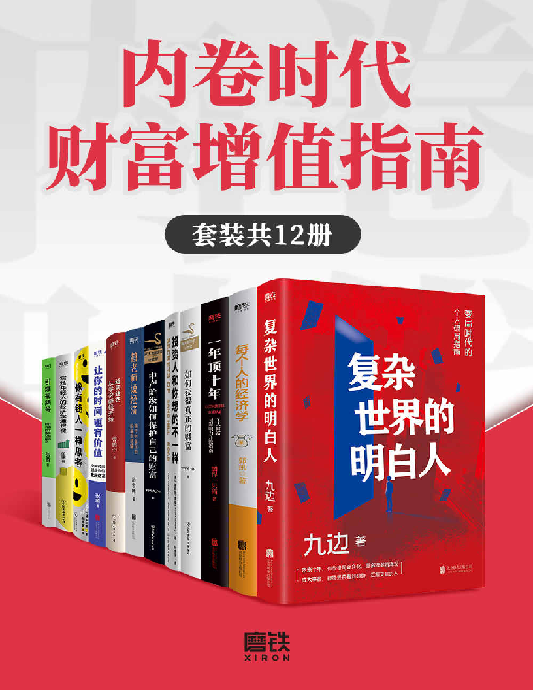

# 内卷时代-财富增值指南

## 套装共 12 册

1. 《复杂世界的明白人》
2. 《每个人的经济学》
3. 《一年顶十年：个人财富与影响力升级指南》
4. 《如何获得真正的财富》
5. 《投资人和你想的不一样》
6. 《中产阶级如何保护自己的财富》
7. 《鹤老师说经济：揭开财富自由的底层逻辑》
8. 《远离迷茫，从学会赚钱开始》
9. 《让你的时间更有价值》
10. 《像有钱人一样思考》
11. 《写给年轻人的经济学通识课》
12. 《引爆视频号：打造个体经济时代的核心能力》

## 下载链接

支持的格式：AZW3、EPUB、MOBI、PDF

* [AZW3](./download/内卷时代财富增值指南（套装共12册）%20-%20九边%20&%20鹤老师%20&%20郭凯%20&%20等.azw3)
* [EPUB](./download/内卷时代财富增值指南（套装共12册）%20-%20九边%20&%20鹤老师%20&%20郭凯%20&%20等.epub)
* [MOBI](./download/内卷时代财富增值指南（套装共12册）%20-%20九边%20&%20鹤老师%20&%20郭凯%20&%20等.mobi)
* [PDF](./download/内卷时代财富增值指南（套装共12册）%20-%20九边%20&%20鹤老师%20&%20郭凯%20&%20等.pdf)

---

